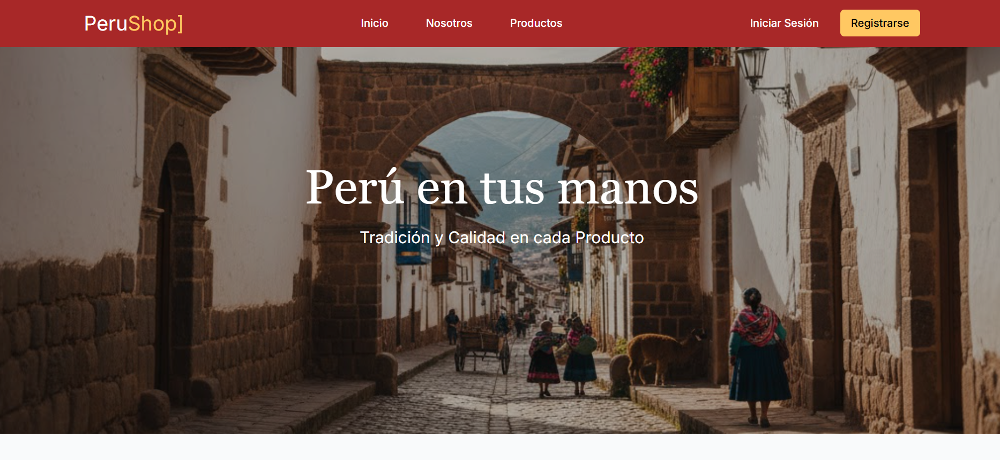

# PeruShop

---

## 💡 Tema y descripción del proyecto

**PeruShop** es una tienda dedicada a la venta de productos artesanales basados en técnicas culturales de distintas partes del Perú.
Este proyecto está construido con **Astro 5** y **TailwindCSS 4**, enfocado en rendimiento, estética y simplicidad.



---

## 🎯Propósito del proyecto

El objetivo principal de este sitio web es:
- Presentar visualmente los productos tradicionales que contiene la tienda.
- Brindar una experiencia rápida y fluida, optimizada para todos los dispositivos.
- Servir como base escalable para futuras integraciones (como carrito de pedidos o pasarela de pagos).

---

## 🌐 Tecnologías utilizadas

- **Astro 5** — Framework moderno orientado a contenido estático e islas interactivas.
- **TailwindCSS 4** — Para un diseño limpio, responsivo y fácil de mantener.
- **TypeScript** — Tipado estático y mejor DX.
- **HTML**  — Estructura semántica y accesible.

---

### 🚀 Estructura general

```
├── public/                     # Imágenes
│   ├── categorias/             
│   ├── nosotros/
│   └── tecnicas/
│   
├── src/                                       
│   ├── assets/ 
│   │  
│   ├── components/             # Componentes Astro
│   │   └── icons/              # Íconos SVG reutilizables
│   │
│   ├── layouts/                # Base del sitio
│   │   
│   ├── pages/                  # Ruta principal (index)
│   │ 
│   └── styles/                 # Archivo global de estilo
│
└── package.json
```

---

## ✅ Requisitos técnicos

Se debe tener instalado las siguientes herramientas:

- **Node.js** v18 o superior.
- **pnpm** recomendado por Astro para mayor rendimiento. 
- **Git** recomendado.
- **Visual Studio Code** u otro editor moderno.

---

## 🧞 Ejecutar el proyecto

### 1️⃣ Clonar el repositorio

```bash
git clone https://github.com/ieeecsutp/perushop.git
cd perushop
```

### 2️⃣ Instalar dependencias
Si usas **pnpm**:
```bash
pnpm install
```

### 3️⃣ Ejecutar en modo desarrollo
```bash
pnpm dev
```
Servidor local (por defecto http://localhost:4321).

---

### 📌 Créditos  
Este proyecto fue desarrollado como parte del programa SparkLabs.  

Desarrollado por **Cristopher Ponce**  
GitHub: [Cristopher552] (https://github.com/Cristopher552) • [LinkedIn](www.linkedin.com/in/cristopher-ponce-pacheco-97615035a)

