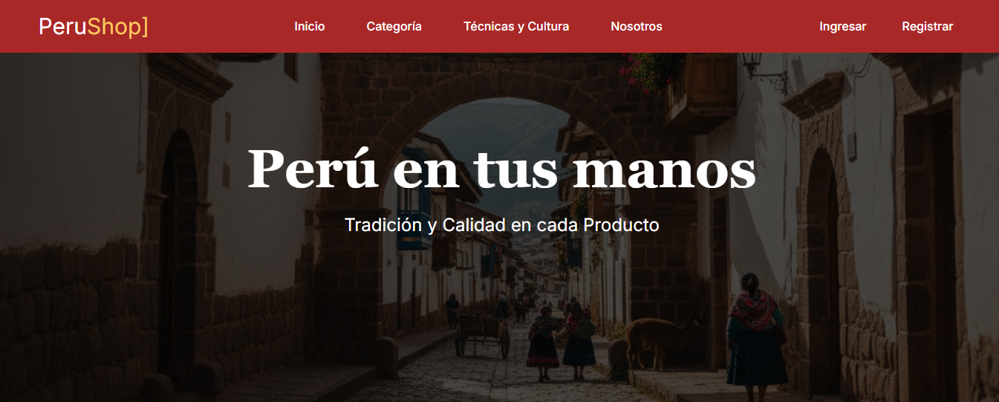
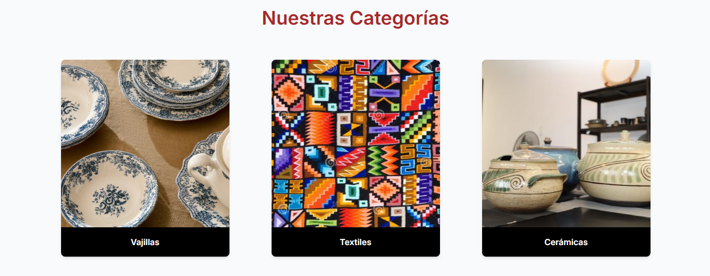
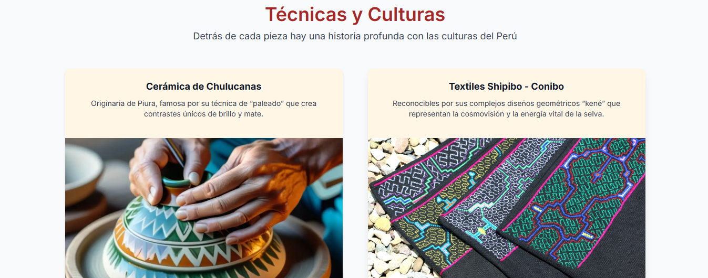
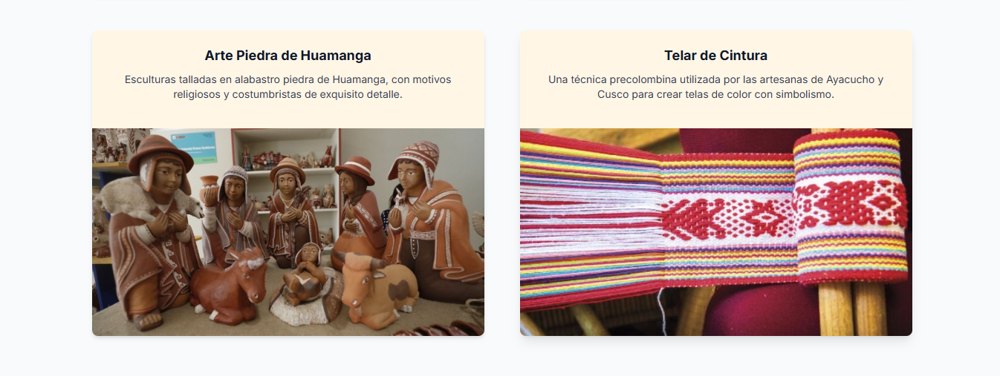
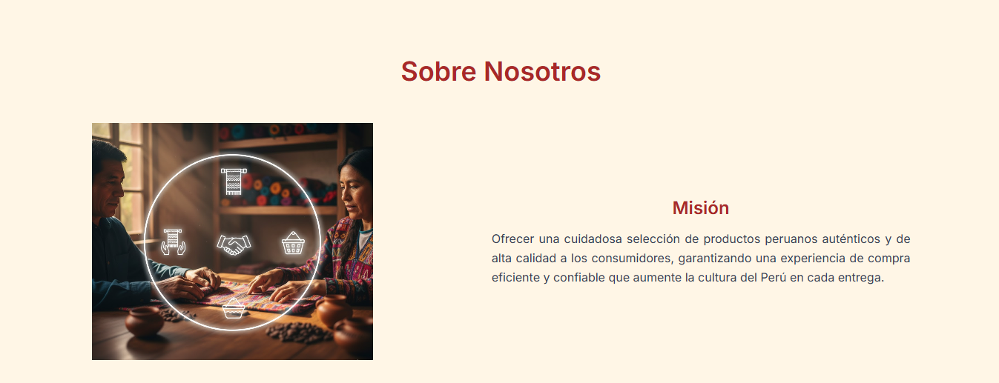
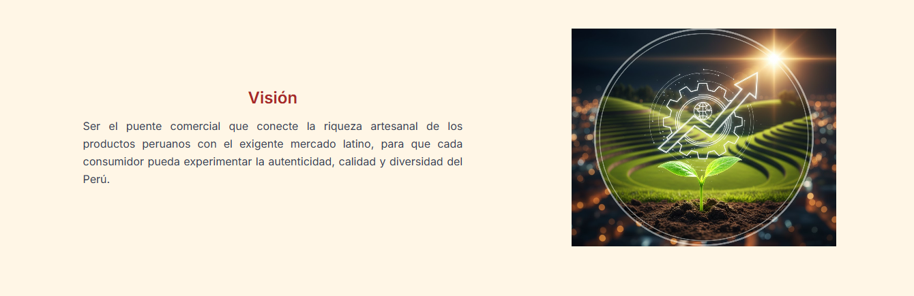

# PeruShop

## Descripción del proyecto
Landing page para **PeruShop**, una tienda online peruana de productos auténticos, mostrando categorías, técnicas culturales y la sección "Sobre Nosotros". El proyecto está diseñado de manera **responsiva** para escritorio y móvil.

## Tecnologías utilizadas
- HTML
- CSS
- TailwindCSS
- JavaScript
- Astro

## Capturas de pantalla

### Vista de escritorio

Archivo .fig exportado dentro del proyecto:

© 2025 PeruShop]. Todos los derechos reservados.